# 어댑터 액션 다이어그램

## IssueAdapter 인터페이스 전체 구조

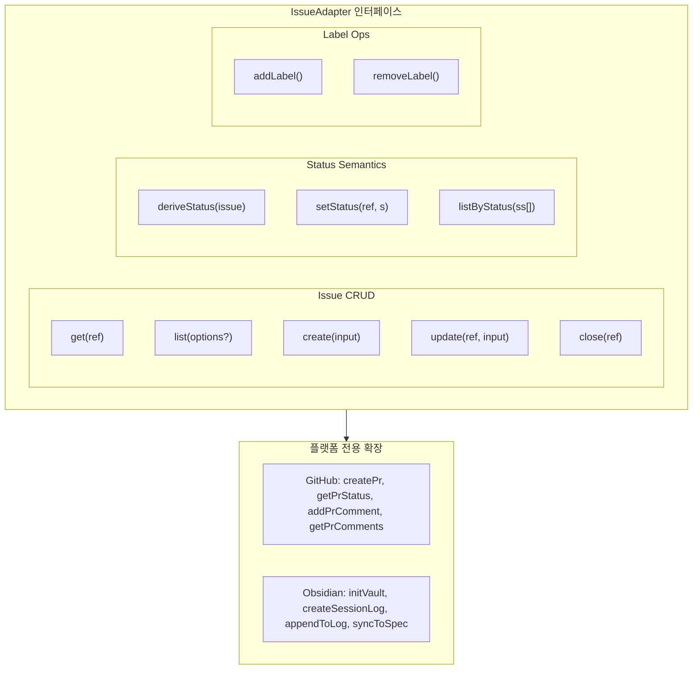

---

## 액션별 플랫폼 구현

### get

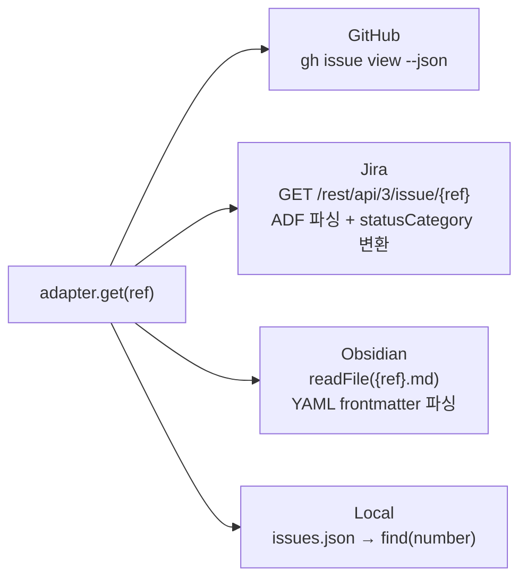

### list

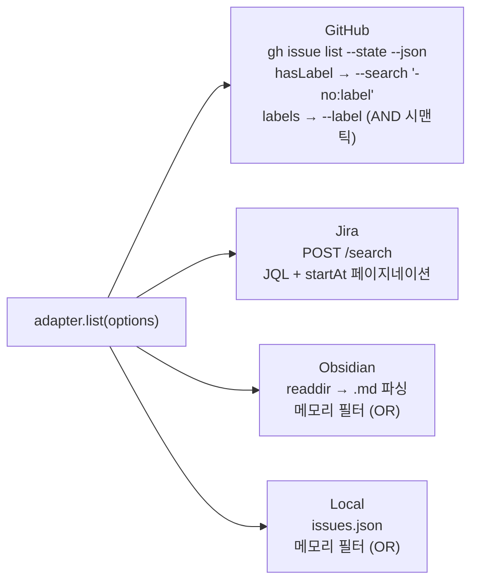

### create

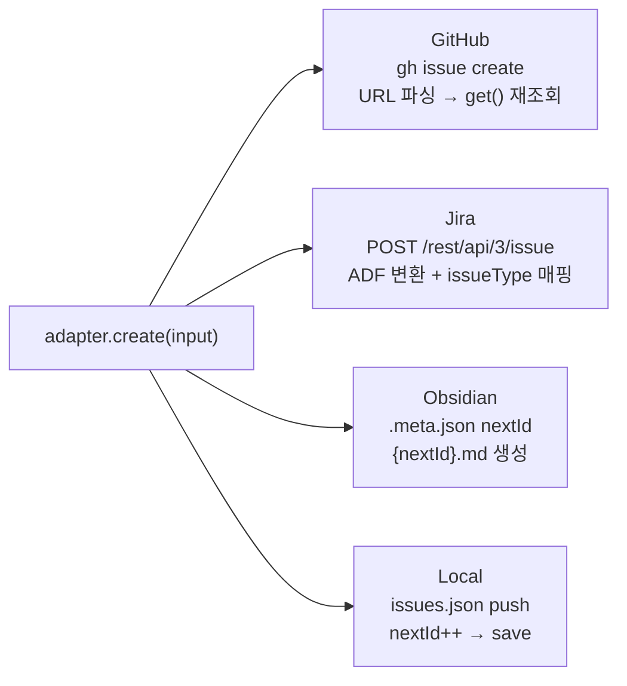

### update / close

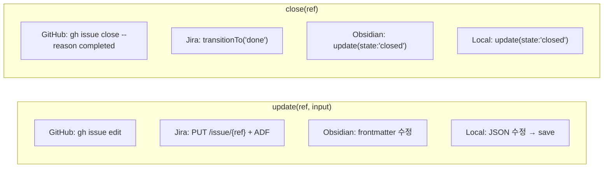

### addLabel / removeLabel

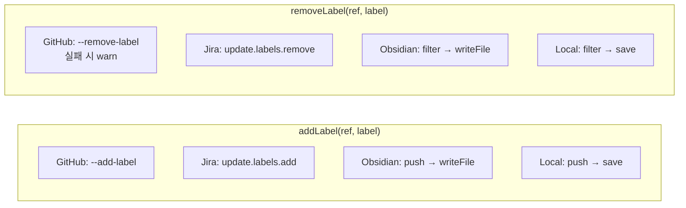

---

## 상태 시맨틱 (Status Semantics)

### 상태 흐름

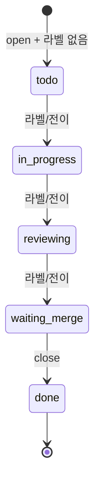

### deriveStatus

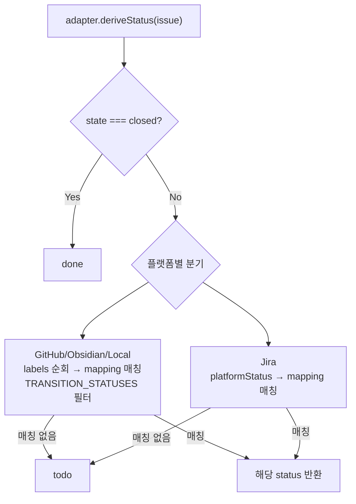

### setStatus

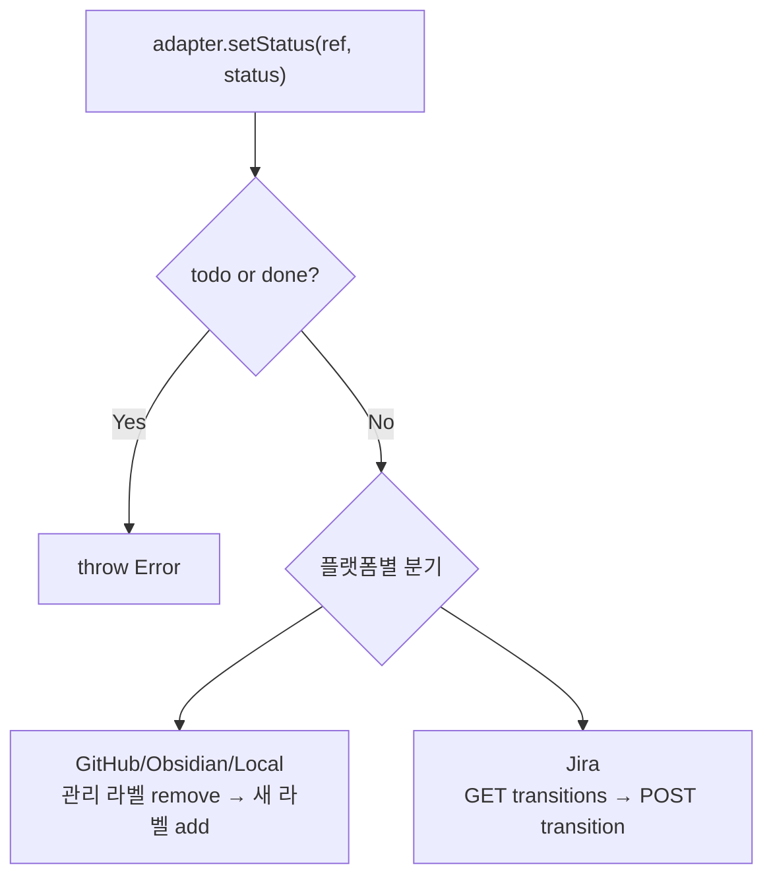

### listByStatus

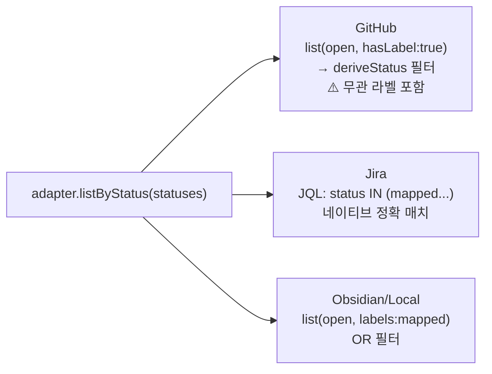

---

## 플랫폼 전용 확장

### GitHub: PR 관리

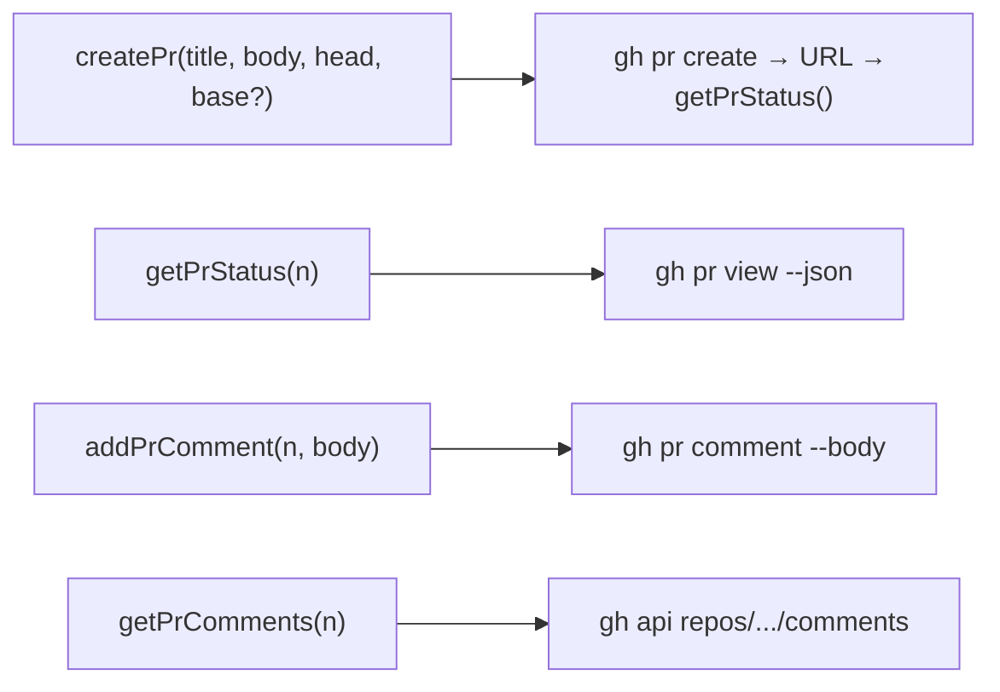

### Obsidian: 볼트 & 세션 로깅

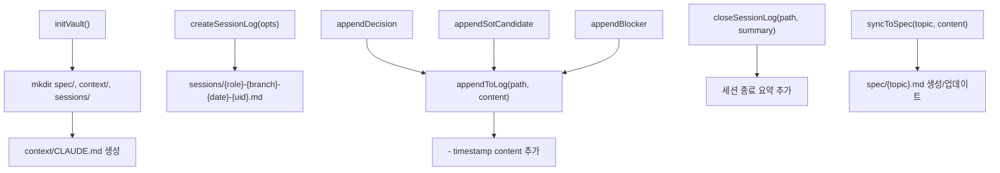

---

## StatusMapping (3키)

| 내부 키 | GitHub | Jira | Obsidian | Local |
|---------|--------|------|----------|-------|
| `in-progress` | `in-progress` | `In Progress` | `in-progress` | `in-progress` |
| `reviewing` | `in-review` | `REVIEWING` | `reviewing` | `reviewing` |
| `waiting-merge` | `awaiting-merge` | `WAITING MERGE` | `waiting-merge` | `waiting-merge` |
| `todo` (파생) | open + 라벨 없음 | open + 매핑 없음 | open + 라벨 없음 | open + 라벨 없음 |
| `done` (파생) | closed | statusCategory=done | state: closed | state: closed |

## 데이터 저장 비교

| 항목 | GitHub | Jira | Obsidian | Local |
|------|--------|------|----------|-------|
| 저장소 | GitHub API (원격) | Jira API (원격) | `{n}.md` (로컬) | `issues.json` (로컬) |
| 상태 메커니즘 | label | workflow transition | frontmatter labels | JSON labels |
| 통신 방식 | gh CLI (execFile) | REST API (fetch) | 파일시스템 (fs) | 파일시스템 (fs) |
| 인증 | gh auth | Basic Auth (API토큰) | 없음 | 없음 |
| 페이징 | `--limit` | startAt (POST) | N/A | N/A |
| PR 지원 | ✅ | ❌ | ❌ | ❌ |
| 세션로깅 | ❌ | ❌ | ✅ | ❌ |
